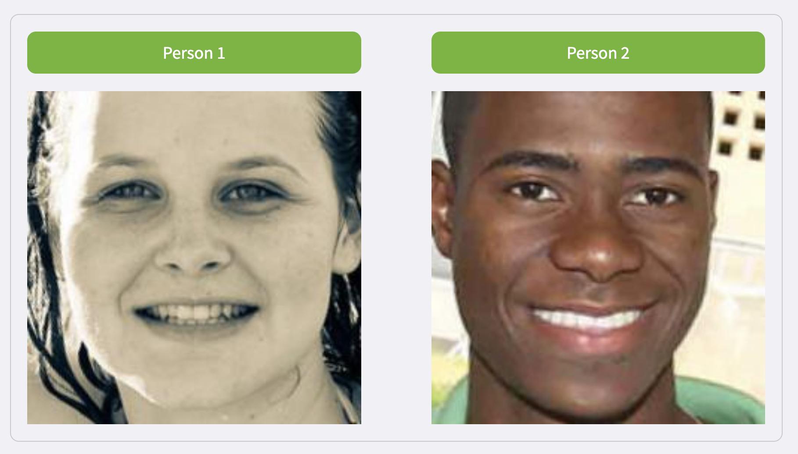

# 📷 PictoPercept

Welcome to PictoPercept! We study human preferences in an increasingly digitized world. We create choice scenarios, where you can make choices by comparing two images 👀.

**🐙 Team** 

- [Saurabh Khanna](https://saurabh-khanna.github.io/)
- [Irene van Driel](https://www.uva.nl/profiel/d/r/i.i.vandriel/i.i.van-driel.html)
- [Alex Barco Martello](https://www.deusto.es/en/home/we-are-deusto/team/researchers/67712/investigador)
- [Chei Billedo](https://www.uva.nl/profiel/b/i/c.j.billedo/c.j.billedo.html)
- [Sindy Sumter](https://www.uva.nl/en/profile/s/u/s.r.sumter/s.r.sumter.html)
- [Lauren Taylor](https://www.uva.nl/en/profile/t/a/l.n.taylor/l.n.taylor.html)
- [Olga Eisele](https://www.uva.nl/profiel/e/i/o.e.eisele/o.e.eisele.html)

**🌱 Supported By**

- Digital Communication Methods Lab, University of Amsterdam 
- Amsterdam School of Communication Research 

Reach out to [saurabh.khanna@uva.nl](mailto:saurabh.khanna@uva.nl) for questions/feedback/collaboration.
